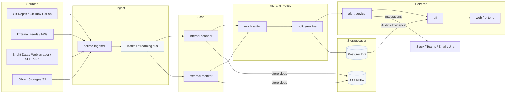

**System Architecture**

This document describes the high-level system architecture for the `leak-radar` codebase based on the repository layout. It includes a Mermaid diagram showing components, data flow, and deployment notes.

**Component Responsibilities**

- `source-ingestor`: fetches configured sources (repo mirrors, feed polling, storage connectors) and writes normalized events to the streaming bus (Kafka). Handles authentication and incremental syncs.
- `bright-data` / web-scraper integration: optional connector that uses third-party proxy/scraping providers (e.g. Bright Data) or in-house scrapers to collect public web content and SERP results. Data fetched here is normalized and passed to the `source-ingestor` for pipeline ingestion; the connector handles rate limits, IP rotation, and legal/consent checks.
- `internal-scanner` / `external-monitor`: lightweight scanners that consume source events, extract candidates (potential secrets or sensitive artifacts) and emit candidate records for classification.
- `ml-classifier`: scores and classifies candidates to reduce false positives and prioritize true findings.
- `policy-engine`: applies organizational policies, determines severity, triggers automated actions (alerts, tickets, remediation hooks), and writes audit records to Postgres.
- `alert-service`: formats notifications and integrates with Slack, Teams, email, or ticketing systems (Jira), including interactive links or remediation actions.
- `bff` + `web`: backend-for-frontend and web UI for viewing findings, evidence, tuning detectors, and audit exports.
- `Postgres`: stores metadata, findings, policy decisions, and audit logs. `ObjectStore` holds evidence blobs and redacted artifacts.

**Design Notes & Tradeoffs**

- Streaming-first (ingest -> Kafka -> processors): keeps end-to-end latency low and enables backpressure. The system can be operated in a low-buffer mode (small retention, partitioned streams) to avoid large persistent queues while retaining replay capability for reprocessing.
- Cost effectiveness: prioritized ML scoring reduces wasted compute and human time by surfacing high-confidence findings. Incremental scanning and sampling policies reduce scan cost for large codebases.
- Privacy & audit: evidence redaction is applied before storage or when exporting, and audit records in Postgres are kept separately from full artifacts.
- Extensibility: detectors, integrations, and policy rules are pluggable so teams can add new source connectors or custom remediation hooks.

**Deployment & Operational Notes**

- Containerized services (Docker / Kubernetes). The repo contains k8s charts and docker-compose files (`infra/` and `infra/k8s/`) for local dev and cluster deployment.
- Observability: each service should emit structured logs, metrics, and traces. Alerting should be configured for processing lag, error rates, and ML model drift.
- Scaling: scanners and classifiers are horizontally scalable consumers of Kafka. Postgres should be sized for metadata and audit load; heavy blob storage should go to object storage.

If you want, I can also:

- Generate a visual SVG/PDF of the architecture (Mermaid → SVG or PNG).
- Produce a sequence diagram for a full detection lifecycle (ingest → scan → classify → policy → alert).
- Map repository folders to these components (I can annotate which code lives where).

Which of these follow-ups would you like next?
